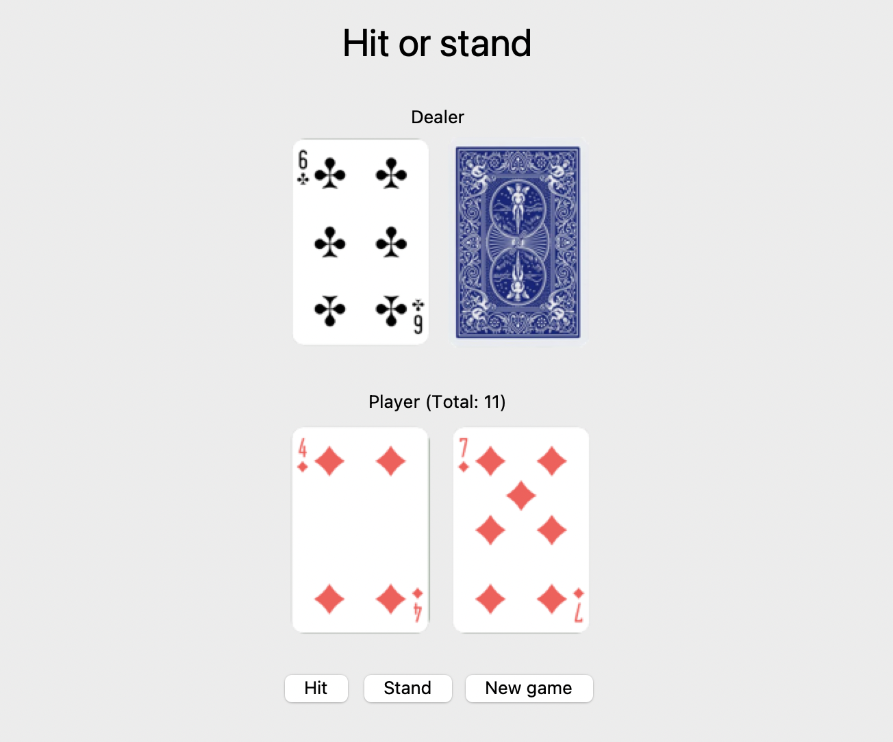

# python-tkinter-black-jack

Creating a Blackjack game in Python with Tkinter between a player and a computer.

---

## Features
- The game is played with a standard deck of cards that is shuffled before each round.
- Each player is dealt two cards at the beginning of the game. The computer only shows one of its cards.
- The player can choose to take more cards (hit) or stand on their current cards (stand).
- The player can continue taking cards until they reach 21 points or more.
- If the player goes over 21 points, they lose immediately.
- When the player stands, the computer takes its turn. The computer must draw cards as long as the sum of its cards is less than 17 points and must stand when its total reaches 17 points or more.
- If the computer goes over 21 points, the player wins regardless of the player’s hand.
- If neither the player nor the computer goes over 21 points, the one with the highest card total wins.

---

## Screenshots



---

## Installation

```bash
# Clone the repository
git clone https://github.com/bacchus80/python-tkinter-black-jack.git

# Navigate to the project folder
cd python-tkinter-black-jack

# Install dependencies (if any)
pip install -r requirements.txt

---

## Usage

Run the project: `python main.py` or `python3 main.py`